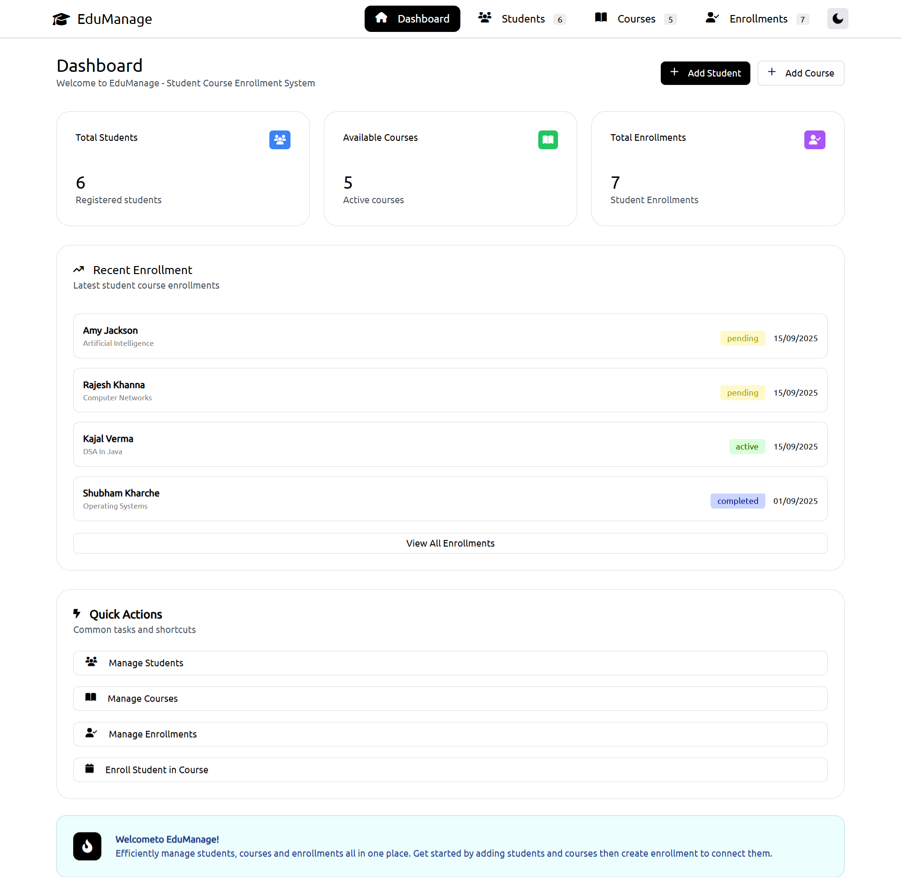
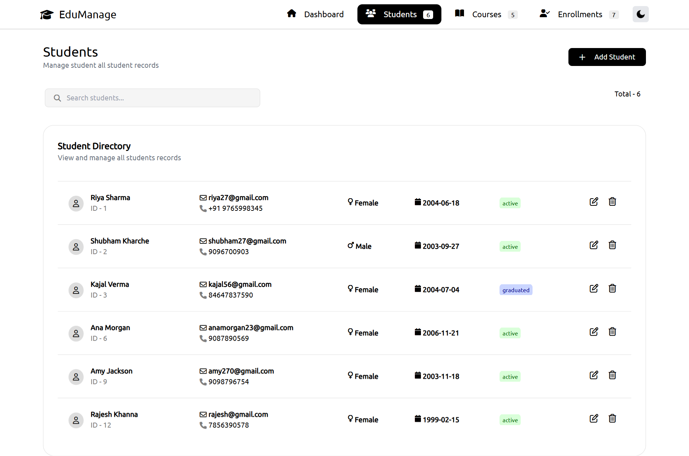
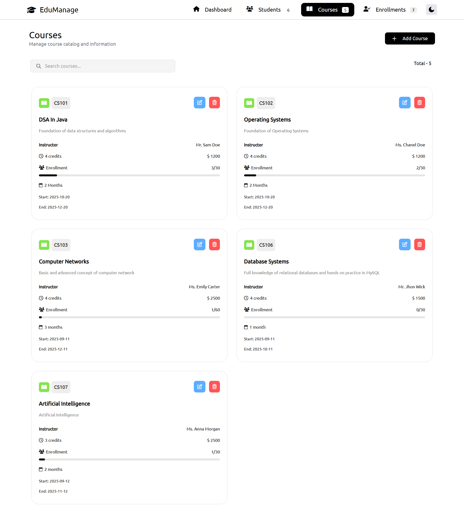
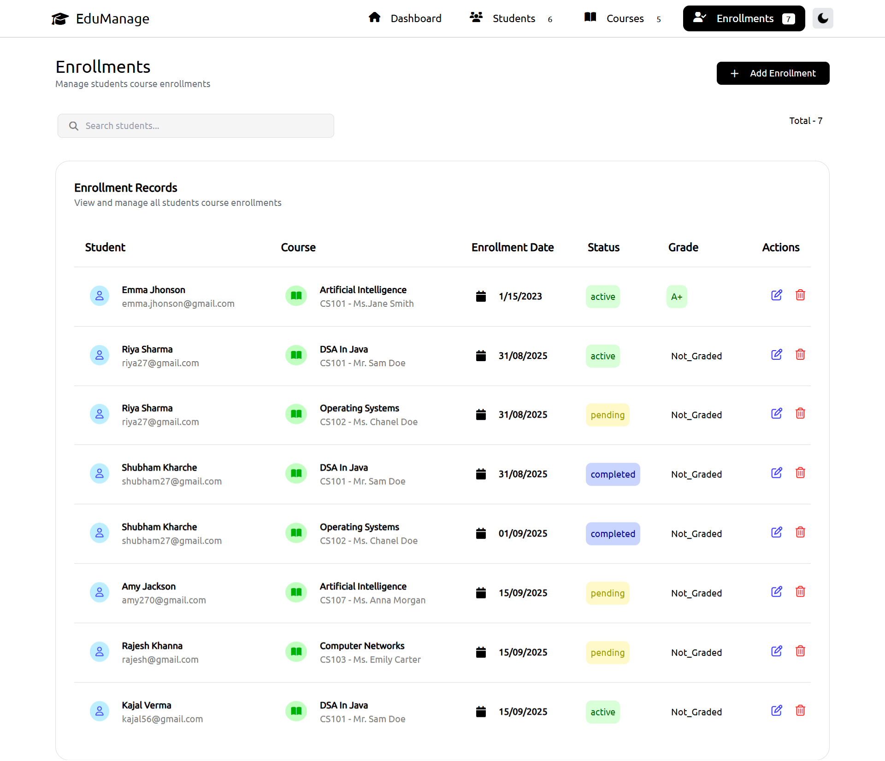

# 📚 Student Course Enrollment System

This is a Spring Boot application that handles student enrollments for courses. It supports basic CRUD operations for students, courses, and enrollments. The system uses proper DTOs, ModelMapper, and bi-directional JPA relationships (OneToMany/ManyToOne). Global exception handling is also implemented.

## 🎨 Frontend

- ### Dashboard Page


- ### Student Page


- ### Student Page


- ### Student Page



## 📌 Features

- Add, view, update, and delete Students
- Add, view, update, and delete Courses
- Enroll Students in Courses
- Fetch Enrollments with Student and Course info
- Proper relationship mapping using JPA
- DTO layer with ModelMapper
- Global exception handling for better error responses

## 🛠️ Tech Stack

- Java 22
- Spring Boot 3.5.3
- Spring Data JPA
- MySQL
- Maven
- ModelMapper
- IntelliJ IDEA

## ⚙️ Entity Relationships

Student (1) ------ (∞) Enrollment (∞) ------ (1) Course
- One Student can have multiple Enrollments
- One Course can have multiple Enrollments


## 🔧 API Endpoints

### 👨‍🎓 Student

- POST `/students/post` - Create new student
- GET `/students/get` - Get all students
- GET `/students/get/byId/{id}` - Get student by ID
- PUT `/students/put/{id}` - Update student
- DELETE `/students/delete/{id}` - Delete student

### 📘 Course

- POST `/courses/post` - Create new course
- GET `/courses/get` - Get all courses
- GET `/courses/get/byId/{id}` - Get course by ID
- PUT `/courses/put/{id}` - Update course
- DELETE `/courses/delete/{id}` - Delete course

### 📝 Enrollment

- POST `/enrollments/post` - Enroll a student in a course
- GET `/enrollments/get` - Get all enrollments
- GET `/enrollments/get/byId/{id}` - Get enrollment by ID
- PUT `/enrollments/put/{id}` - Update enrollment
- DELETE `/enrollments/delete/{id}` - Delete enrollment

## ⚙️ Setup Instructions

```bash
# 1️⃣ Clone the Repository
git clone https://github.com/your-username/student-course-enrollment-system.git
cd student-course-enrollment-system

# 2️⃣ Configure MySQL
# Open MySQL and run:
CREATE DATABASE student_course_db;

# Then update src/main/resources/application.properties:
# ----------------------------------------
# spring.datasource.url=jdbc:mysql://localhost:3306/student_course_db
# spring.datasource.username=your_mysql_username
# spring.datasource.password=your_mysql_password
# spring.jpa.hibernate.ddl-auto=update
# ----------------------------------------

# 3️⃣ Build the Project
mvn clean install

# 4️⃣ Run the Application
mvn spring-boot:run
